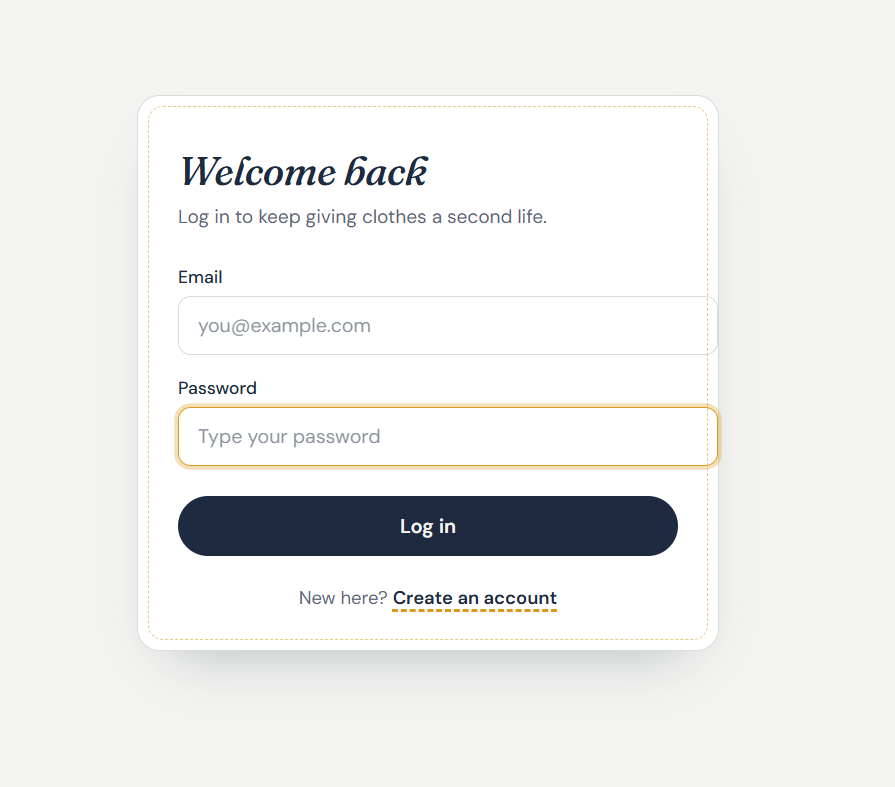
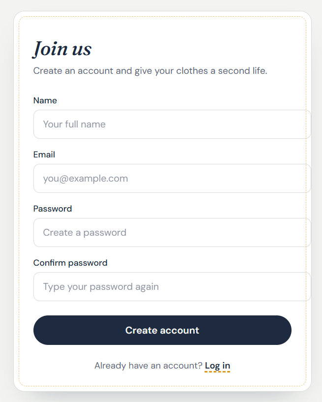
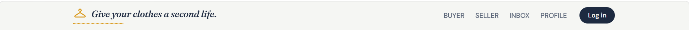

# Give Your Clothes a Second Life

A MERN-stack platform for exchanging fashion instead of throwing it away. If you own a piece of clothing you no longer wear — a pair of pants you're bored of, a jacket that no longer fits — you can list it for other people to buy at a low price or claim for free. It's entirely up to the owner how much (if anything) to charge. The goal is to help people refresh their style while keeping clothes in circulation instead of in landfills.

## ✦ Why This Exists

Fast fashion creates enormous textile waste — clothes worn a handful of times before being discarded. This platform makes it easy to pass clothing on to someone who'll actually wear it:

- **For sellers** — clear out a wardrobe and earn a little money, or give items away for free.
- **For buyers** — refresh their style affordably without buying new.
- **For the environment** — every reused item is one less item manufactured, dyed, shipped, and eventually landfilled.

## ✦ Features

- **Authentication** — Register and log in with email and password, secured with JWT.
- **Buyer Role** — Browse and claim listed clothing items, at whatever price the seller has set (including free).
- **Seller Role** — List clothing items with a price of your choosing, or mark them as free.
- **Inbox** — Message other users to arrange exchanges, ask questions about an item, or coordinate pickup/delivery.
- **Profile** — Manage your account and view your own listings.
- **Responsive, Minimal UI** — Clean, editorial-style design with a warm, sustainability-driven visual identity (navy, off-white, gold thread accents).

## ✦ Screenshots

**Login**


**Register**


**Navbar**


## ✦ Tech Stack

- **Frontend:** React (Next.js or Create React App — update to match your setup)
- **Backend:** Node.js, Express
- **Database:** MongoDB with Mongoose
- **Auth:** JWT (`jsonwebtoken`)
- **Styling:** CSS

## ✦ Project Structure

```
client/
├── src/
│   ├── components/
│   │   ├── Navbar/
│   │   ├── Login/
│   │   └── Register/
│   ├── pages/
│   │   ├── Buyer/
│   │   ├── Seller/
│   │   ├── Inbox/
│   │   └── Profile/
│   └── App.js
server/
├── controllers/
│   ├── authController.js
│   ├── itemController.js
│   └── messageController.js
├── models/
│   ├── User.js
│   ├── Item.js
│   └── Message.js
├── routes/
│   ├── authRoutes.js
│   ├── itemRoutes.js
│   └── messageRoutes.js
└── server.js
```

## ✦ Getting Started

### Prerequisites

- Node.js installed
- A MongoDB database (local or MongoDB Atlas)

### Installation

```bash
git clone <your-repo-url>
cd give-clothes-a-second-life

# install backend dependencies
cd server
npm install

# install frontend dependencies
cd ../client
npm install
```

### Environment Variables

Create a `.env` file in `server/`:

```
MONGODB_URI=your_mongodb_connection_string
JWT_SECRET=your_jwt_secret
PORT=5000
```

### Run the App

```bash
# from server/
npm run dev

# from client/, in a separate terminal
npm start
```

## ✦ How It Works

1. **Register** — Create an account with name, email, and password.
2. **Login** — Returns a JWT used to authenticate future requests.
3. **List an Item (Seller)** — Upload photos and details of a clothing item, and set a price — or mark it free.
4. **Browse (Buyer)** — Explore listed items from other users and claim the ones you want.
5. **Inbox** — Message the seller to arrange price (if negotiable), pickup, or delivery.
6. **Profile** — View and manage your account and listings.

## ✦ Roadmap

- [ ] Item listing form with photo upload
- [ ] Buyer browsing/search and filters (size, category, price range)
- [ ] In-app messaging between buyer and seller
- [ ] Favorites / saved items
- [ ] Ratings or reviews for sellers
- [ ] Location-based browsing for local exchanges (reduces shipping impact)

## ✦ License

This project is currently unlicensed. Add a license of your choice (e.g. MIT) before publishing.